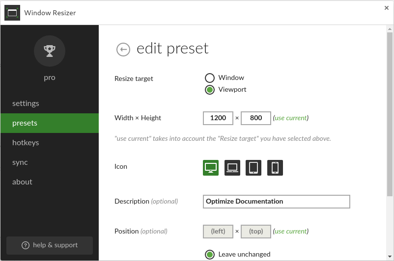

# The Cawemo Documentation Sources

This repository contains the sources of the Cawemo Documentation.

**Important:** _do NOT change the content of `themes/camunda` directory directly!_
Instead, Change the [theme](//github.com/camunda/camunda-docs-theme).

## Installing Hugo

In order to build this documentation, you first need to install [hugo][hugo] v0.50 (newer versions _may_ work).

See the [hugo installation guide][hugo-installation] for more details on howto install Hugo.

## Building the Documentation

After you have installed hugo, you can build the docs by typing the following command:

```bash
hugo
```

A static build of the documentation will be placed in the `public/` folder.

While editing the docs, you probably want to start the hugo server (defaults to "watch mode"):

```bash
hugo server --baseUrl="http://localhost"
```

You can then browse the docs under [http://localhost:1313/](http://localhost:1313/).
Hugo will automatically detect when you change a file and refresh the page in the browser.

## License

<a rel="license" href="http://creativecommons.org/licenses/by-sa/3.0/"></a> The content on this site is licensed under a <a rel="license" href="http://creativecommons.org/licenses/by-sa/3.0/">Creative Commons Attribution-ShareAlike 3.0 Unported License</a>.

## Writing Docs

Some guidelines for writing docs

### How can I add an image?

#### Where should I put the image?

Images should be put next to the content page which references them.

So, if you have a file named `user-guide/configuration/overview.md` and you want to add an image named `architecture-overview.png` then it should be placed in the same folder.

#### How can I reference the image?

Use the `img` shorthand:

```html

```

### How can I add a note?

Use the `note` shorthand:

```html
 The content of the note. * full *
markdown is supported 
```

Supported classes:

- `info`
- `warning`

### How can I highlight code lines

By using the `code` which can highlight 1 line or a range of lines (and you can set that multiple times).

```html
<?xml version="1.0" encoding="UTF-8"
standalone="yes"?>
<cmmn:definitions
  id="_d7e7cad4-86f1-4c04-9dff-a9aace3afb61"
  targetNamespace="http://cmmn.org"
  xmlns:cmmn="http://www.omg.org/spec/CMMN/20151109/MODEL"
  xmlns:xsi="http://www.w3.org/2001/XMLSchema-instance"
  xmlns:camunda="http://camunda.org/schema/1.0/cmmn"
>
  <cmmn:case id="loan_application">
    <cmmn:casePlanModel
      autoComplete="false"
      name="Loan Application"
      id="CasePlanModel"
    >
      <!-- Plan Items -->
      <cmmn:planItem definitionRef="HumanTask_1" id="PI_HumanTask_1" />

      <!-- ... -->
    </cmmn:casePlanModel>
  </cmmn:case> </cmmn:definitions
>
```

## How do I make screenshots for documentation

### Setup

In Chrome browser install the following two extensions:

- Window resizer: to resize the view/window page to the require resolution
- Fireshot: to take the actual screenshot

In order to speed up the window resizing process, it can make sense to define a preset in the window resizer addon. Make sure that resize target is _Viewport_ and the resolution is _1200x800_. See an example of the configuration here:


### How to create a screenshot

The following procedure ensures that all screenshot are consistent:

1. Go to the page you want to take a screenshot of
2. Use the window resizer to adjust the size to _1200x800_. Make sure the window target is set to viewport!
3. Use fireshot to take a screenshot of the visible page and save it.
4. Go to [google docs drawings](https://docs.google.com/drawings) and create a new drawing document.
5. Here click on the _file_ menu entry and then choose the page setup. In the opening modal you can set the resolution to _1200x800_.
6. Paste the saved screenshot and adjust it to the canvas size.
7. Optional you can add boxes and arrows for explanation:

- use standard rectangular boxes with the default background color
- use default arrows with a line weight of 2px

8. Click on the _file_ menu entry and choose download as: _PNG image_

## Writing Guidelines

- Use short sentences. Full stop is better than comma.
- Don't constantly repeat context: One a Page named _Updating Camunda_ not every headline needs to start with _"Updating this"_, _"Updating that"_. Instead just write _"This"_ or _"That"_. It is clear to the reader that things are being updated. Other example: if the page is named _"Installing the Full Distribution for JBoss Application Server"_ not every section needs to mention the application server: Instead of _"The following steps are necessary in order to install the REST Api on JBoss"_ write: _"The following steps are necessary in order to install the REST Api:"_
- Don't overuse notes and warning. Not everything that comes into mind while writing a paragraph is a note or a warning. Maybe it is just content. There should not be more notes and warnings than content.
- Yes, you programmed the stuff but you don't need to write the docs in a super self-conscious way: instead of _"We use slf4j for logging"_ write: _"Slf4j is used for logging"_.
- Don't use the future form: instead of _"This document will guide you through he steps of..."_ write _"This document guides you through the steps"_
- Nice combination of the previous two points: _"Throughout this guide, we will use a number of variables to denote common path names and constants:"_ => _"This guide uses the following variables to denote common path names and constants:"_
- Use this tool to convert titles into title case: [title converter][title converter]

[hugo]: http://gohugo.io/
[hugo-installation]: http://gohugo.io/overview/installing/
[camunda nexus]: https://app.camunda.com/nexus/content/repositories/public/hugo/
[title converter]: http://individed.com/code/to-title-case/
