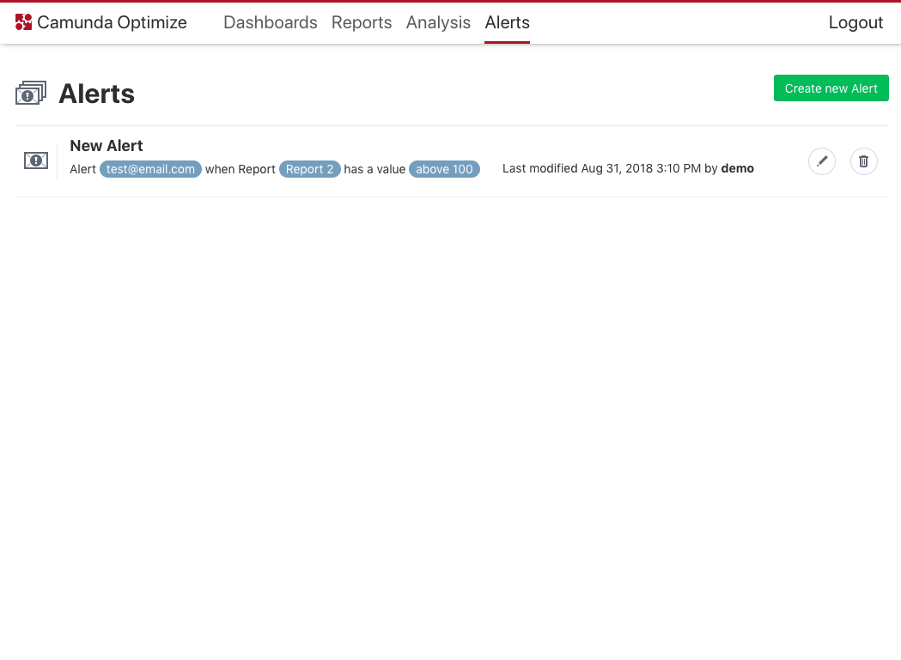

---

title: 'Alerting'
weight: 80

menu:
  main:
    identifier: "alerting"
    parent: "user-guide"
    pre: "Get a notification as soon as your system is behaving in an unexpected manner."
---


You need to configure the email service to get notifications. See [here](), which properties need to be defined.


For the cases where you want to be notified when your report hits a critical value, Optimize has the Alerting function. Once you have created an Alert you will see it on the alerts page, which is also depicted on the screenshot below. You can manage an Alert by clicking on the Edit or Delete buttons next to it.

{{}}

Click the Create new Alert button in order to create new Alert. You will then see the following modal:

{{}}

You need to give the alert a name, define an email address of the person who will receive the alert and state the report, which causes the alert. Alerts can only be created for reports, which are visualized as a single number. Have a look at the [report section]() on how to define single number reports.

In addition, you need to set a threshold, when an alert should be triggered. Notification will be sent to the email address as soon as report value hits the threshold, then (in case you enabled reminder notifications) each period of time you defined, as long as the value is above (or below, as defined) the threshold. Finally, you'll get a resolve notification, as soon as the report value is back to normal range.

For example: you defined an alert which should be triggered when the report value becomes greater than 50.
You also enabled reminder notifications to be sent each hour. Here's what you get:

{{}}

