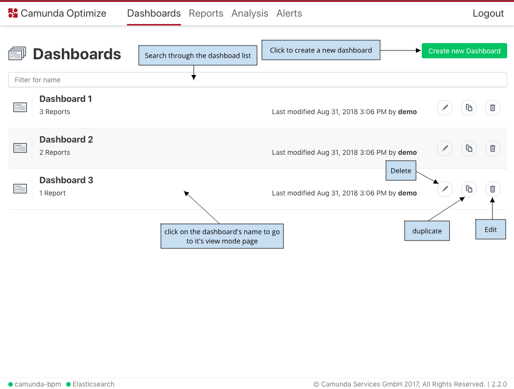

---

title: 'Available Dashboard List'
weight: 20

menu:
  main:
    identifier: "available-dashboards"
    parent: "user-guide"
    pre: "See all available dashboards at one glance."
---

In the "Dashboards" section of Optimize you can see a list of dashboards you created.

There's a possibility to create a new dashboard, edit, duplicate, delete, or go to the view mode of the existing ones.

It is also possible search through the existing dashboards using the search input field.

{{}}
