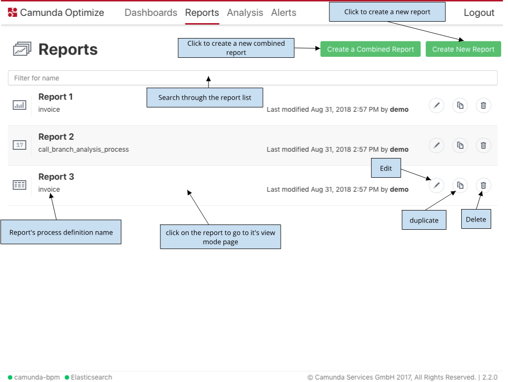

---

title: 'Available Report List'
weight: 30

menu:
  main:
    identifier: "available-reports"
    parent: "user-guide"
    pre: "See all available reports at one glance."
---

In the "Reports" section of Optimize you can see a list of reports you created.

There's a possibility to create a new report, edit, duplicate, delete, or go to the view mode of the existing ones.

It is also possible search through the existing reports using the search input field.

{{}}
