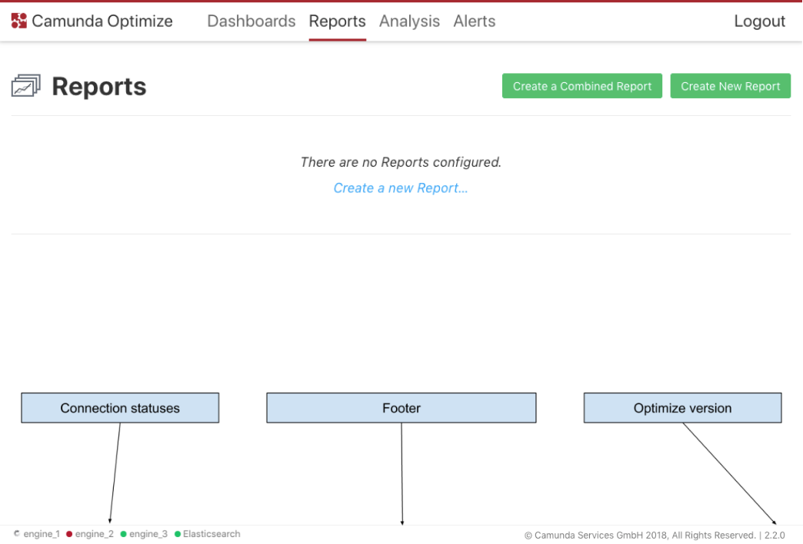
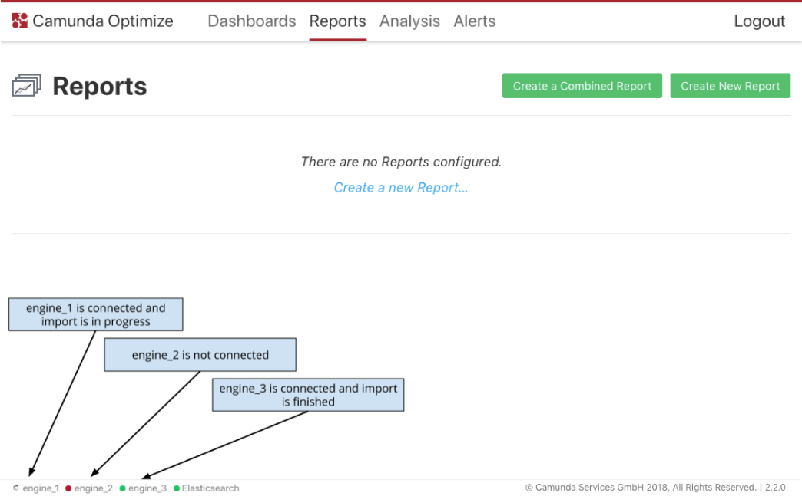

---

title: 'Footer'
weight: 100

menu:
  main:
    identifier: "footer"
    parent: "user-guide"
    pre: "Get an overview about the connection status of the engine, elasticsearch and the Optimize version."
---

In the Footer section you can see some important information, such as:

* Engine connections status: for each engine that is connected to Optimize the connection status is shown. Thus, you are immediately aware if there is something wrong with the engine and new data can be imported at all.
* Status of connection to Elasticsearch
* Import progress: indicates if Optimize is currently importing data from the engine. That makes it transparent if we can create reports and perform the analysis on the whole data set or just parts of it.
* Optimize version

{{}}

There are 3 possible states of engine connection:

* Connected and import finished (green circle)
* Connected and import is not completed (spinner)
* Not connected (red circle)

Elasticsearch can be either connected or not (green and red circles respectively).

{{}}

