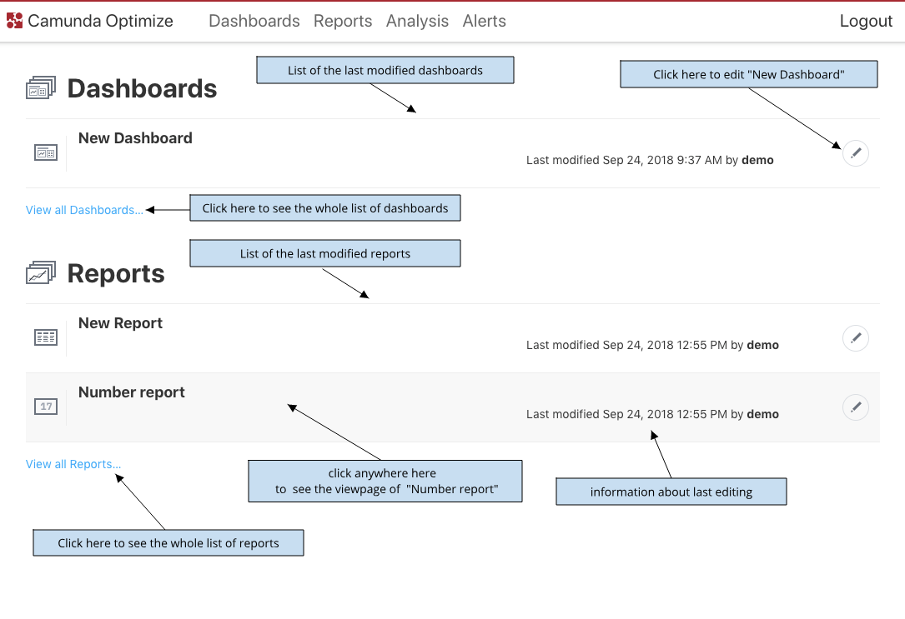

---

title: 'Homepage'
weight: 10

menu:
  main:
    identifier: "homepage"
    parent: "user-guide"
    pre: "Get an overview of most recently used reports and dashboards for a quick access."
---

The Optimize homepage shows you 5 most recently modified dashboards and 5 most recently modified reports including it's name and information about when and by who it was last modified.
By clicking on the dashboard's/report's name, you can go directly to the respective view mode page.
The "Edit" button leads you to the edit mode page.

Below the list you can see the "View all dashboards..." button, which leads you to a page with all avaliable dashboards listed.
There is also a button "View all reports..." with the same function for reports list.

{{}}
